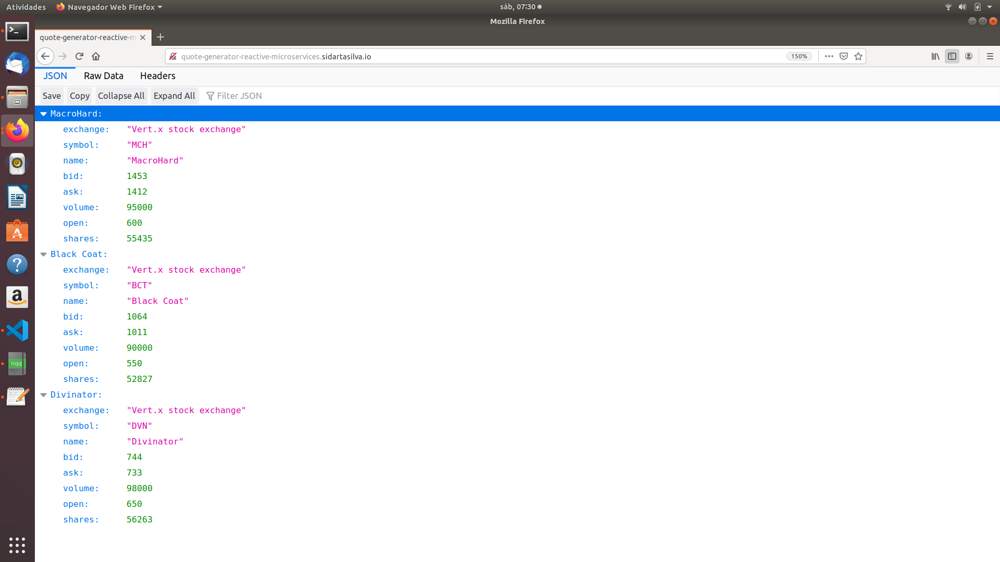

# Building Reactive Microservice Systems

This project is based mainly on the references below.

    <http://escoffier.me/vertx-kubernetes/>
    
    ESCOFFIER, C. Building Reactive Microservices in Java Asynchronous and Event-Based Application Design. First Edition. California: O’Reilly Media, Inc., 2017.

    RedHat Developer, accessed 1 November 2019, <https://developers.redhat.com/promotions/building-reactive-microservices-in-java>

    Kubernetes Hands-On - Deploy Microservices to the AWS Cloud 2018, Udemy, accessed 1 November 2019, <https://www.udemy.com/course/kubernetes-microservices>

    <https://github.com/hazelcast/hazelcast-code-samples/>

    <https://vertx.io/docs/vertx-hazelcast>

## The Micro-Trader Application

### The first microservice - the quote generator

Disclaimer, the quote generator is unrealistic, and is basically a set of randoms.

In this chapter, we are going to see:

    * how projects are structured, built, and deployed

    * how to use the event bus to receive messages

    * how to implement HTTP actions

    * how to use RX Java 2 to avoid callbacks

    * using config maps to configure the application

### Verticle

As you may have noticed, the code is structured in 3 verticles, but what are these?

Verticles are a way to structured Vert.x application code. It's not mandatory, but it is quite convenient. A verticle is a chunck of code that is deployed on top of a Vert.x instance. A verticle has access to the instance of vertx on which it's deployed and can deploy other verticles.

            @Override
            public void start(Future<Void> future) {

                discovery = ServiceDiscovery.create(vertx);
                ConfigRetriever retriever = ConfigRetriever.create(vertx, getConfigurationOptions());

                retriever.rxGetConfig()
                    // Read the configuration, and deploy a MarketDataVerticle for each company listed in the configuration.
                    .flatMap(config -> 
                        Observable.fromIterable(config.getJsonArray("companies"))
                            .cast(JsonObject.class)
                            // Deploy the verticle with a configuration
                            .flatMapSingle(company -> vertx.rxDeployVerticle(MarketDataVerticle.class.getName(),
                                new DeploymentOptions().setConfig(company)))
                            .toList()
                    )
                    // Deploy another verticle
                    .flatMap(l -> vertx.rxDeployVerticle(RestQuoteAPIVerticle.class.getName()))
                    // Expose the market-data message source
                    .flatMap(x -> discovery.rxPublish(MessageSource.createRecord("market-data", ADDRESS)))
                    .subscribe((record, err) -> {
                        if (rec != null) {
                            this.record = rec;
                            future.complete();
                        } else {
                            future.fail(err);
                        }
                    });
            }

This method retrieves the configuration, instantiates the verticles (5 verticles are deployed), and publishes the service in the service discovery.

First, notice the method signature. It receives a Future object indicating that the start is asynchronous. Indeed, all the actions made in this method are asynchronous. So when the caller thread reaches the end of the method the actions may have not completed. We use this given Future to indicate when the process has completed (or failed);

The start method:

    1. retrieves the configuration (giving the "fake" company settings)

    2. deploys the verticle per defined company

    3. deploys the RestQuoteAPIVerticle

    4. exposes the market-data message source.

    5. notifies the given Future of the successful completion or failure.

To retrieve the configuration the verticle needs a ConfigRetriever. This object allows retrieving chunks from different stores (such as git, files, http, etc.). Here we just load the contents of the config.json file located in the src/main/resources directory. The configuration is a JsonObject.

Once we have the retriever, we can retrieve the configuration. This is an asynchronous method (rxGetConfig) returning a Single (a stream containing one item). After the configuration is retrieved, we extract the companies array from it and deploy one verticle per defined company. The deployment is also asynchronous and done with rxDeployVerticle. These company verticles simulate the value of the stocks. The quotes are sent on the event bus on the market address.

When the company verticles are deployed, we deploy another verticle providing an HTTP API to access market data. The last part of the method is about the service discovery mentioned in the microservice section. This component generates quotes sent on the event bus. But to let other components discover where the messages are sent (where means on which address), it registers it. market-data is the name of the service, ADDRESS (a static final variable defined as market) is the event bus address on which the messages are sent.

Finally, when everything is done, we report the status on the given Future object.

Remember, Vert.x is promoting an asynchronous, non-blocking development model. Retrieving the configuration, deploying verticles, publishing a service may take time, as we cannot block the event loop, these methods are asynchronous. This code uses RX Java 2 and asynchronous methods are prefixed with rx. Upon completion the method returns a Single emitting the result or failure.

The failure management can be done at any stage, but, generally, it's done in the subscribe method:

            object.rxAsync(param1, param2)
            // ...
                .subscribe((rec, err) -> {
                    if (rec != null) {
                        future.complete();
                    } else {
                        future.fail(err);
                    }
                }
                    
                );

If you remember the architecture, the quote generator also provides an Http endpoint returning the last values of the quotes. Note that this service is not explicitly published in the service discovery. That's because Kubernetes is taking care of this part. The Vert.x service discovery interacts with Kubernetes services, so all Kubernetes services can be retrieved by Vert.x.

## The quote REST endpoint

It is time for you to develop some parts of the application. Open the RestQuoteAPIVerticle file. It is a verticle class extending AbstractVerticle. In the start method you need to:

    1. Receive the event bus market messages to collect the last quotations (in the quotes map)

    2. Handle Http requests to return the list of quotes or a single quote if the name (query) param is set.

In this example we are using streams (Flowable). Streams are an important part of reactive programming and architecture. So it is important to understand how they work and how we manipulate them.

Let's do that.

## Task - Implementing a Handler to receive events

The first action is about observing the stream of market messages. This is done using vertx.eventBus().<JsonOject>consumer(GeneratorConfigVerticle.ADDRESS).toFlowable(). We now have the stream of messages but we need to extract the Json body and populate the quotes map. Implement the missing logic that extracts the body of the message (with the body() method), and then puts name -> quote in the quotes map.

            @Override
            public void start(Future<Void> startFuture) throws Exception {
                
                // Get (consume) the stream of messages sent on the "market" address.
                vertx.eventBus().<JsonObject>consumer(GeneratorConfigVerticle.ADDRESS).toFlowable()
                // TODO: Extract the body of the message using `.map(msg -> {})`
                //-----

                    .map(Message::body)
                //-----
                // TODO: For each message, populate the `quotes` map with the received quote. Use  
                // `.doOnNext(json -> {})
                // Quotes are json objects you can retrieve from the message body
                // The map is structured as follows: name -> quote
                // -----

                    .doOnNext(json -> {
                        quotes.put(json.getString("name"), json);
                    })

                //-----
                .subscribe();

## Task - Implementing a Handler to handle HTTP requests

Now that you have the quotes, let's use them to handle Http requests. The code already creates the Http server and provides the stream of Http requests. The stream emits an item for every Http request received by the server. So you need to handle the request and write the response.

Write the content of the request handler to respond to the request:

    1. a response with the content-type header set to application/json (already done)

    2. retrieve the name parameter (it's the company name)

    3. if the company name is not set, return all the quotes as json.

    4. if the company name is set, return the stored quote or a 404 response if the company is unknown

        * The response to a request is accesible using request.response()

        * To write the response use response.end(content)

        * To create the Json representation of an object, you can use the Json.encode() method.

        HttpServer server = vertx.createHttpServer();
        server.requestStream().toFlowable()
                .doOnNext(request -> {
                    HttpServerResponse response = request.response()          // 1. Get the response object from the request
                            .putHeader("content-type", "application/json");

                    // TODO: Handle the Http request
                    // The request handler returns a specific quote if the `name` parameter is set, or the whole map if none.
                    // To write the response use: `response.end(content)`
                    // If the name is set but not found you should return 404 (use response.setStatusCode(404)).
                    // To encode a Json object, use the `encodePrettily` method.
                    // -----

                        
                    String company = request.getParam("name");                 // 2. Gets the name parameter (query parameter) 

                    if (company == null) {
                        String content = Json.encodePrettily(quotes);          // 3. Encode the map to JSON
                        response.end(content);                                 // 4. Write the response and flush it using end(...)
                    } else {
                        JsonObject quote = quotes.get(company);
                        if (quote == null) {
                            response.setStatusCode(404).end();                  // 5. If the given named does not match a company, set the status code to 404
                        } else {
                            response.end(quote.encodePrettily());
                        }
                    }
                    
                })

        .subscribe();                                                           // 6. Notice the subscribe here. Without it, we would not get the requests

You may wonder why synchronization is not required. Indeed, we write in the map and read from it without any synchronization constructs. Here is one of the main features in Vert.x: all this code is going to be executed by the same event loop, so it is always accessed by the same thread, never concurrently.

## Creating a config map

A config map is a Kubernetes entity storing the configuration of an application. The application configuration is in src/main/resources/config.json. We are going to create a config map from this file. In a terminal, execute

            kubectl create configmap app-config --from-file=src/main/resources/config.json

To check that the config map has been created correctly, execute:

            kubectl get configmap -o yaml

It should display the Kubernetes entity and in the data entry our JSON content.

Now that the config map is created, let's read it from our application. There are several wasy to consume a config map:

            * ENV variables

            * Config mounted as a file

            * Vert.x Config

We are going to use the second approach and mount the configuration as a file in the application container. Indeed, our application has been configured to read its configuration from a config.json file.

            private ConfigRetrieverOptions getConfigurationOptions() {
                JsonObject path = new JsonObject().put("path", System.getenv("CONTAINER_PATH"));
                return new ConfigRetrieverOptions().addStore(new ConfigStoreOptions().setType("file").setConfig(path));
            }

Fortunately, our deployment.yaml contains the right configuration to:

    1. define a volume with the config map content

    2. mount this volume in the right directory

            apiVersion: apps/v1
            kind: Deployment
            metadata:
            name: quote-generator
            spec:
            replicas: 1
            selector:
                matchLabels:
                app: quote-generator
            template:
                metadata:
                labels:
                    app: quote-generator
                spec:
                containers:
                - name: quote-generator
                    image: sidartasilva/quote-generator:latest
                    env:
                    - name: CONTAINER_PATH
                    valueFrom:
                        configMapKeyRef:
                        name: global-config
                        key: config.path
                    imagePullPolicy: Always
                    ports:
                    - containerPort: 5701
                    - containerPort: 8080
                    volumeMounts:
                    - name: config
                    mountPath: /etc/any/directory/config
                volumes:
                - name: config
                    configMap:
                    name: app-config
                    items:
                    - key: config.json
                        path: config.json

            ---
            apiVersion: v1
            kind: Service
            metadata:
            name: quote-generator
            spec:
            type: LoadBalancer
            selector:
                app: quote-generator
            ports:
            - name: hazelcast
                port: 5701
            - name: app
                port: 8080

You can also see that this file contains the Hazelcast configurations.

## Time to start the quote generator

Let's build and deploy the microservice fat-jar. Once deployed, go to the browser and enter http://quote-generator-reactive-microservices.sidartasilva.io/.

You should see:

